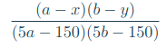

# 202unsold



With:

- x the price a jacket
- y the price of a trouser
- a and b being integers greater than 50

Let’s call X, Y and Z, respectively, the random variables that represent “the price of a sold jacket”, “the price of sold trousers” and “the price of a sold suit”. Given the values of a and b, the program print:

- an array summing up the joint law of (X, Y), and the marginal laws of X and Y,

- an array summing up the law of Z,

- expected values and variances of X, Y and Z.

## Compile

The project compile with *Makefile*:

For compile the project use the commande:

```console
foo@bar:~/202unsold$ make re
```

For clean the project use:

```console
foo@bar:~/202unsold$ make fclean
```

Get instruction with:


```console
foo@bar:~/202unsold$ ./202unsold -h
```

